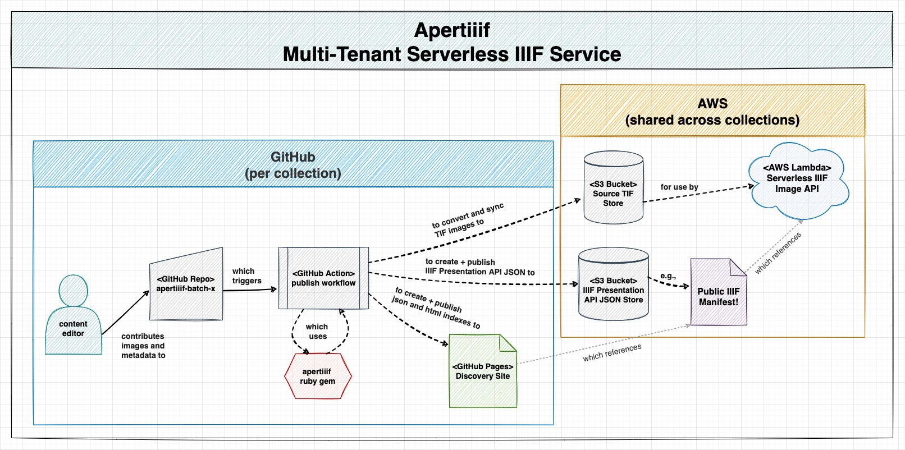

# apertiiif-cli

gem-packaged commands for processing apertiiif batches 🥂

[](https://github.com/nyu-dss/apertiiif/actions/workflows/rspec.yml) [](https://github.com/nyu-dss/apertiiif/actions/workflows/reek.yml) [](https://github.com/nyu-dss/apertiiif/actions/workflows/rubocop.yml)  

[](https://codeclimate.com/github/nyu-dss/apertiiif/maintainability) [](https://codeclimate.com/github/nyu-dss/apertiiif/test_coverage)

## Overview



> View as [PDF](./docs/apertiiif.pdf).


## Prerequisites
- [Ruby Version Manager](https://rvm.io/rvm/install)
- [Git](https://git-scm.com/downloads)
- [Vips](https://www.libvips.org/install.html)

## Installation

### Recommended

It is highly recommended that you use the [apertiiif-batch-template](https://github.com/nyu-dss/apertiiif-batch-template) repo to create your new batch project. This method will include all the necessary Ruby dependencies and project structure.

### Manual

Alternatively, you can add the gem to your project's Gemfile:

``` ruby
gem 'apertiiif', github: 'nyu-dss/apertiiif-cli'
```

Then install by running the command:

``` sh
bundle install
```

## Usage

After your batch project is set up and you have installed the dependencies using Bundler, you will have access to the `apertiiif` commands.

1. Check available commands
  ```sh
  bundle exec apertiiif --help
  ```
2. Check available batch commands
  ```sh
  bundle exec apertiiif batch --help
  ```
  You will see something like:
  ```sh
  ➜ bundle exec apertiiif batch --help
    Commands:
    apertiiif batch build           # build batch resources
    apertiiif batch help [COMMAND]  # Describe subcommands or one specific subc...
    apertiiif batch lint            # lint the batch
    apertiiif batch reset           # reset the batch
  ```

## Development

Contributions should:
- Avoid code smells
- Follow style guide
- Update tests as needed
- Update documentation as needed

To ensure the above, this repo includes configuration for [reek](https://github.com/troessner/reek) and [rubocop](https://github.com/rubocop/rubocop) as well as [rspec](https://rspec.info/) tests. You can run them respectively with the following commands:

```sh
bundle exec reek
```
```sh
bundle exec rubocop -A
```
```sh
bundle exec rspec
```
